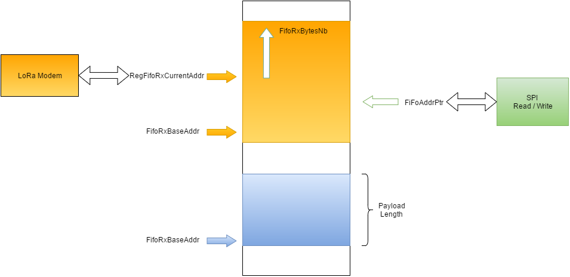
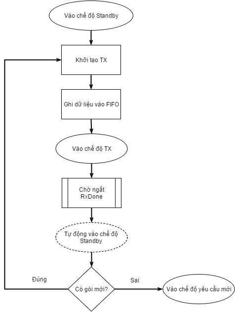
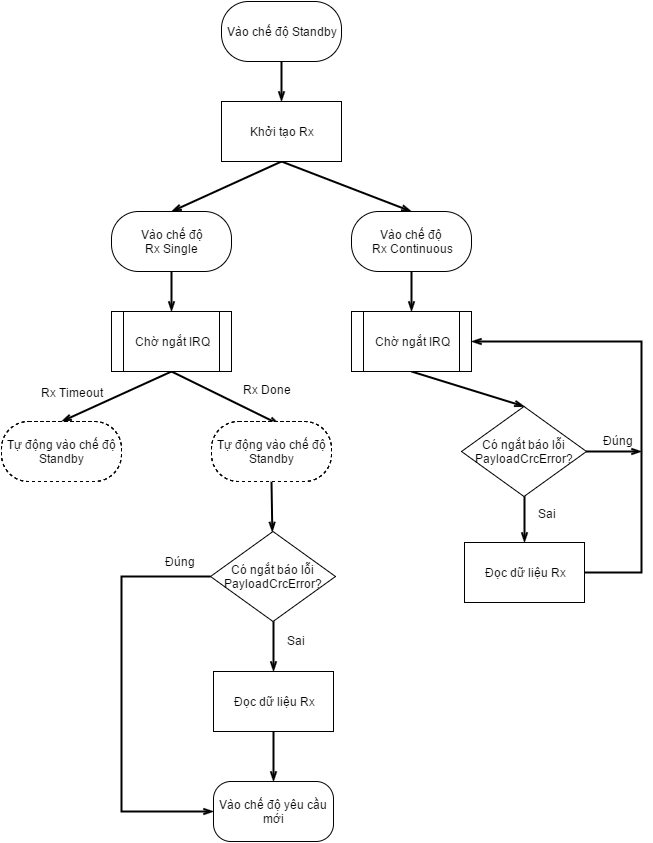

# LoRa là gì?

LoRa là một kỹ thuật không dây được phát triển để tạo nên năng lượng thấp, mạng diện rộng (LPWANS) được đòi hỏi cho các ứng dụng M2M và IoT. 

Kỹ thuật điều chế sóng LoRa được phát minh năm 2010 bởi startup Cycleo của Pháp, sau đó được mua lại năm 2012 bởi công ty Semtech. Hiện nay Semtech độc quyền các dòng chip LoRa.

## SX1276/77/78/79

Dòng chip SX1278 tích hợp bộ modem trải phổ mà nó có khả năng đặt được khoảng cách rộng đáng kể so với hệ thống dựa trên điều chế FSK hay OOK. 

Các dòng chip SX1276/77/78/79 gần như giống nhau về đặc tính, cách hoạt động, chỉ khác nhau về các hệ số trải phổ và băng thông. SX1278 đưa ra nhiều lựa chọn về băng thông và hệ số trải phổ, nhưng chỉ hoạt động ở băng tần thấp hơn UHF.

| Chip | Khoảng tần số | Hệ số trải phổ | Băng thông | Tốc độ bit hiệu quả | Độ nhạy 		 |
|:------:|:---------------:|:----------------:|:------------:|:---------------------:|:-----------------:|
|SX1276|137-1020 Mhz   |6-12            | 7.8-500 kHz|0.012-37.5 kbps      |-111 đến -148 dBm|
|SX1277|137-1020 Mhz   |6-9             | 7.8-500 kHz|0.11-37.5 kbps       |-111 đến -139 dBm|
|SX1278|137-525  Mhz   |6-12            | 7.8-500 kHz|0.012-37.5 kbps      |-111 đến -148 dBm|
|SX1279|137-960  Mhz   |6-12            | 7.8-500 kHz|0.012-37.5 kbps      |-111 đến -148 dBm|

Do trong người viết chỉ sử dụng chip SX1278 nên từ đây sẽ nói những đặc tính của SX1278.

SX1278 là một bộ thu phát low-IF bán song công. SX1278 bao gồm hai bộ tham chiếu thời gian, một là bộ dao động RC và một bộ dao động thạch anh 32 Mhz.

Mọi thành phần phía ngoại vi RF và trạng thái máy số cấu hình hoàn toàn thông qua giao tiếp SPI cho phép truy cập và các thanh ghi SX1278. 

SX1278 được trang bị cả bộ điều giải tiêu chuẩn FSK và bộ điều giải trải phổ diện rộng (LoRa). 

## Đặc điểm kỹ thuật số

Chế độ diện rộng LoRa cung cấp truyền thông trải phổ khoảng cách rất xa và độ can nhiễu cao trong khi tối thiểu dòng tiêu thụ. Nó phối hợp trải phổ số, xử lý tín hiệu số, và mã hõa sửa lỗi forward để đạt được hiệu suất chưa từng có. 

LoRa có ba thành phần chính có thể cấu hình được:

* Băng thông (BW)
* Tỉ lệ mã hóa (CR)
* Hệ số trải phổ (SF)

### Hệ số trải phổ

Hệ số trải phổ là số lượng chips trên mỗi symbol được sử dụng trong xử lý dữ liệu trước khi truyền tín hiệu đi. 

|Hệ số trải phổ  (RegModulationCfg)|Hệ số trải phổ  (Chips/symbol)|SNR bộ giải điều chế   LoRa|
|:--------------------------------------:|:----------------------------------:|:-------------------------:|
|6                                     |64								  |-5 dB  					|
|7									   |128								  |-7.5 dB 				    |
|8									   |256								  |-10 dB 					|
|9									   |512								  |-12.5 dB 				|
|10									   |1024							  |-15 dB 					|
|11									   |2048						      |-17.5 dB 				|
|12									   |4096							  |-20 dB 					|

Trong các kỹ thuật trải phổ, giá trị của thành phần này càng lớn, khả năng bộ thu tránh nhiều càng cao. Giá trị trải phổ càng lớn, thời gian để nó gửi một gói tin nhiều hơn, nhưng khoảng cách được xa hơn bởi vì bộ thu có độ nhạy tốt hơn.

### Tỉ lệ mã hóa

Để cải thiện độ mạnh của kết nối hơn nữa modem LoRa dùng mã hóa lỗi tuần hoàn để thực hiện việc phát hiện lỗi trước và sửa lỗi. 

|CodingRate  (RegTxCfg1)|Cyclic Coding  Rate|
|:-------------------------:|:---------------------:|
|1							|4/5					|
|2							|4/6					|
|3							|4/7					|
|4							|4/8					|

Giá trị tỉ lệ mã hóa phải được chọn là: 4/5, 4/6, 4/7 và 4/8. Nó chỉ ra rằng mỗi 4 bit có ích sẽ được mã hóa bởi 5, 6, 7 hoặc 8 bit truyền đi phụ thuộc và giá trị của chúng. Tỉ lệ mã hóa nhỏ hơn (nhỏ nhất là 4/8) thời gian truyền cao hơn, vì thế nó cần nhiều thời gian hơn để truyền một gói. Điều này sẽ làm bớt tác vụ của việc thu nhận, bởi vì mỗi symbol rộng hơn ở thời gian, vì thế bộ nhận có thể giải điều chế các gói với khả năng thu nhận thấp hơn. Điều này có nghĩa bộ nhận có độ nhạy tốt hơn, nhưng truyền dữ liệu chậm ảnh hưởng tới việc tiêu thụ pin: dành nhiều thời gian hơn trong chế độ truyền kéo theo tiêu thụ nhiều pin hơn.

### Băng thông

Việc tăng băng thông tín hiệu cho phép sử dụng tốc độ dữ liệu hiệu quả cao hơn, vì thế giảm thời gian truyền để tăng độ nhạy. Nếu đòi hỏi truyền dẫn nhanh, giá trị 500 khz là tốt nhất. Nhưng nếu cần tầm rộng thì giá trị 7.8 kHz cần phải được cấu hình. 

|Băng thông  (kHz)|Hệ số trải phổ|Tỉ lệ mã hóa|Rb quy định (bps)|
|:--:|:--:|:--:|:--:|
|7.8|12|4/5|18|
|10.4|12|4/5|24|
|15.6|12|4/5|37|
.
|125|12|4/5|293|
|250|12|4/5|586|
|500|12|4/5|1172|

*Lưu ý:* Trong băng tần thấp hơn (169 Mhz), băng thông 250 kHz và 500 kHz không được hỗ trợ.

### Cấu trúc gói tin LoRa

Bộ điều giải LoRa dùng hai loại định dạng gói tin, Explicit và Implicit. Gói tin Explicit gồm có một header ngắn mà nó bao gồm thông tin về số lượng byte, tỉ lệ mã hóa và có CRC được sử dụng trong gói tin hay không. 

Gói tin LoRa gồm có 3 yếu tố:

* Một preamble (mở đầu).
* Một header tùy chọn.
* Payload dữ liệu.

#### Preamble 
Preamble được sử dụng để đồng bộ bộ thu với dòng dữ liệu đến. Mặc định gói tin được cấu hình với chuỗi dài 12 symbol. Đây là giá trị có thể lập trình được nên độ dài preamble có thể được mở rộng. Dộ dài preamble được phát đi có thể được thay đổi bằng việc cài đặt thanh ghi *PreambleLength* từ 6 tới 65535.

Bộ thu đảm bảo quá trình phát hiện preamble được restart định kỳ. Vì lý do này độ dài preamble nên được cấu hình đồng nhất với chiều dài preamble bộ phát. Trường hợp mà độ dài preamble không biết trước, hay có thể thay đổi, độ dài preamble tối đa nên được cấu hình ở phía bộ thu.

#### Header
Tùy thuộc vào lựa chọn chế độ hoạt động 2 loại header. 

##### Chế độ Header hiện (Explicit)
Đây là chế độ mặc định, ở đây header cung cấp thông tin của payload:

* Độ dài payload (byte).
* Tỉ lệ mã sửa lỗi phía trước. (The forward error correction code rate)
* CRC 16-bit cho payload.

Header được truyền đi với mã phát hiện lỗi tối đa (4/8). Nó cũng có CRC của nó cho phép bộ thu kiểm tra độ chính xác của header.

##### Chế độ Header ẩn (Implicit)

Trong tình huống nhất định, nơi mà payload, tỉ lệ mã hóa và CRC là cố định hoặc được biết trước, nó có thể có lợi do giảm thời gian truyền. 

Trong chế độ này header bị loại bỏ ra khỏi gói tin. Trong trường hợp này độ dài payload, tỉ lệ mã lỗi và CRC phải cấu hình bằng tay ở cả hai phía của kết nối radio.

*Chú ý: với SF = 6, chỉ sử dụng được chế độ header ẩn (Implicit)*

## LoRa Digital Interface

Modem LoRa bao gồm 3 loại digital interface, các thanh ghi cấu hình tĩnh, các thanh ghi trạng thái và một bộ đêm dữ liệu FIFO. Mọi truy cập thông qua giao tiếp SPI.

### Bộ nhớ đệm FIFO chế độ LoRa

SX1276/77/78/79 được trang bị với một bộ nhớ đệm RAM 256 byte mà nó chỉ được truy xuất trong chế độ LoRa. Vùng RAM này, được tùy chỉnh hoàn toàn bởi người dùng và cho phép truy cập để thu nhận, hoặc truyền dữ liệu. Mọi truy cập tới bộ nhớ đệm dữ liệu LoRa được hoàn thành thông qua chuẩn giao tiếp SPI. 

Bộ nhớ đệm dữ liệu FIFO có thể được đọc trong mọi chế độ hoạt động ngoại trừ chế độ ngủ. Nó tự động xóa nội dung cũ sau qua mỗi lần chuyển tiếp vào chế độ nhận.

### Nguyên lý hoạt động

Do cơ chế cấu hình dual port, nó có thể đồng thời lưu trữ cả thông tin truyền và nhận trong bộ nhớ đệm FiFo. Mặc định, thiết bị được cấu hình tại lúc bật nguồn là dành một nửa bộ nhớ sẵn có cho RX (`RegFifoRxBaseAddr` khởi tạo tại địa chỉ 0x00) và một nửa còn lại dành cho Tx (`RegFifoTxBaseAddr` khởi tạo tại địa chỉ 0x80).

Bộ nhớ đệm dữ liệu FiFo sẽ bị xóa khi thiết bị ở chế độ NGỦ, vì thế không truy cập vào bộ đệm dữ liệu FiFo trong chế độ này. Tuy nhiên, dữ liệu ở bộ nhớ đệm dữ liệu FiFo vẫn được giữ lại khi chuyển qua các chế độ LoRa khác. Bộ đệm dữ liệu không tự xóa (trừ khi nếu thiết bị vào chế độ ngủ) và dữ liệu sẽ chỉ bị "xóa" khi một dữ liệu mới được ghi vào vị trí bộ nhớ đang sử dụng. (ghi đè)

Chú ý rằng dữ liệu nhận được sẽ được ghi vào bộ nhớ đệm FIFO thậm chí nếu CRC không có hiệu lực, nếu kích thước gói tin vượt quá bộ nhớ đệm được cấp phát cho Rx, nó sẽ ghi đè lên phần truyền của bộ nhớ đệm dữ liệu.

## Chế độ hoạt động của modem LoRa

Modem LoRa có các chế độ sau đây

| Chế độ hoạt động | Mô tả |
|:----------------:|:-----:|
|SLEEP| Chế độ công suất thấp. Trong chế độ này chỉ SPI và các thanh ghi cấu hình được truy cập. FIFO LoRa không thể truy cập.|
|STANDBY|Cả bộ dao động Thạnh anh và các khối baseband LoRa được hoạt động. RF và PLLs bị vô hiệu hóa.|
| FSTX | Đây là chế độ tổng hợp tần số cho việc truyền. PLL được chọn cho việc truyền bị khóa và hoạt động tại tần số truyền. Phần RF tắt.|
|FSRX| Đây là chế độ tổng hợp tần số cho việc nhận. PLL được chọn cho việc nhận bị khóa và hoạt động tại tần số nhận. Phần RF tắt.|
|TX|Khi cho hoạt động mọi khối còn lại cần thiết cho việc truyền dẫn, PA, truyền gói tin và trờ về chế độ Standby |
|RXCONTINOUS|Khi cho hoạt động mọi khối còn lại cần thiết cho việc nhận, xử lý mọi dữ hiệu nhận được cho tới khi một yêu cầu người dùng mới được tạo ra để thay đổi chế độ hoạt động.|
|RXSINGLE|Khi cho hoạt động mọi khối còn lại cần thiết cho việc nhận, ở trạng thái này cho tới khi một gói dữ liệu có hiệu lực được nhận và sau đó trở về chế độ Standby|
|CAD|Khi ở chế độ CAD, thiết bị sẽ kiểm tra một kênh truyền đã cho trước để phát hiện tín hiệu preamble LoRa|

## LoRa Modem State Machine Sequences

### Lưu đồ truyền dữ liệu

Trong chế độ truyền, để có được công suất tiêu thụ tối ưu thì chỉ cho phép các khối RF, PLL, RA khi gói dữ liệu cần được phát đi.

* Các thanh ghi cấu hình static chỉ có thể được truy cập ở chế độ Sleep, chế độ Stanbdy hoặc chế độ FSTX.
* FIFO LoRa chỉ có thể được đổ vào ở chế độ Standby.
* Dữ liệu truyền đi được khở tạo bằng việc gửi yêu cầu chế độ TX.

### Lưu đồ nhận dữ liệu

Có 2 chế độ nhận dữ liệu: chế độ bộ nhận 1 lần và nhận liên tục.

#### Chế độ hoạt động nhận một lần

Trong chế độ này, modem dò tìm một preamble trong một chu kỳ thời gian cho trước. Nếu hết chu kỳ (gọi là cửa sổ thời gian) không tìm thấy preamble, chip tạo ra ngắt `RxTimeout` và trở lại chế độ Standby. Độ dài cửa sổ thời gian nhận (symbol) được định nghĩa trong thanh ghi `RegSymbTimeout` và nó trong khoảng 4 tới 1023 symbol.

Tại cuối payload, ngắt `RxDone` được tạo cùng với ngắt `PayloadCrcError` nếu CRC không có hiệu lực. Sau khi có ngắt RxDone radio tự động đi vào chế độ Standby.

Trong chế độ hoạt động nhận một lần, để tiết kiệm năng lượng, ngay khi nhận được gói tin thì tắt các khối PLL và RF. Lưu đồ như sau:

1. Đặt `FifoAddrPtr` thành `FifoRxBaseAddr`.
2. Thanh ghi cấu hình tĩnh có thể được ghi hoặc ở chế độ Sleep, chế độ Stanbdy hoặc ở chế độ FSRX.
3. Bộ nhận sẽ chờ nhận một preamble có hiệu lực. 

#### Chế độ hoạt động nhận liên tục

Trong chế độ nhận liên tục, mode quét liên tục để tìm kiếm một preamble. Mỗi khi một preamble được phát hiện modem bám theo nó tới khi gói tin được nhận và sau đó tiếp tục chờ preamble tiếp theo. 

Trong chế độ RX nhận liên tục, trái ngược với chế độ RX nhận một lần, ngắt `RxTimeout` sẽ không bao giờ xảy ra và thiết bị sẽ không bao giờ vào chế độ Standby một cách tự động.

Trong chế độ nhận liên tục quá trình xử lý như dưới đây:

1. Trong khi ở chế độ Sleep hoặc Standby chọn chế độ RXCONT.
2. Trong lúc nhận một header CRC có hiệu lực thì ngắt `RxDone` được set. Radio ở trong chế độ RXCONT chờ gói tin LoRa tiếp theo.
3. Cờ `PayloadCrcError` sẽ được kiểm tra cho tính toàn vẹn của gói tin.
4. Nếu gói tin nhận được chính xác bộ đêm dữ liệu FIFO có thể được đọc.
5. Quá trình nhận (bước 2-4) có thể được lặp lại hoặc thoát khỏi chế độ này nếu muốn.

#### Mapping các chân DIO trong chế độ LoRa

Có 6 chân GPIO có sẵn được sử dụng ở chế độ LoRa. Việc sắp xếp của chúng được trình bày ở bảng dưới và phụ thuộc vào việc cấu hình thanh ghi `RegDioMapping1` và `RegDioMapping2`. Ở đây chỉ trình bày về các chân sử dụng thường xuyên là DIO3, DIO2, DIO1, DIO0 và 2 chế độ mapping `00` và `01`

| DIOx  Mapping | DIO3 | DIO2 | DIO1| DIO0 |
|:------------------:|:----:|:----:|:---:|:----:|
|00|CadDone|FhssChangeChannel|RxTimeout|RxDone|
|01|ValidHeader|FhssChangeChannel|FhssChangeChannel|TxDone|

Trên đây là những kiến thức cơ bản để bắt đầu tìm hiểu về chip SX127x và cách hoạt động của LoRa. Sau đây là phần lập trình và dự án thực tế để hiểu chi tiết hơn.
