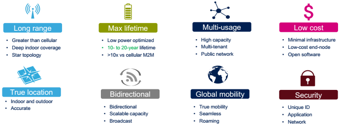
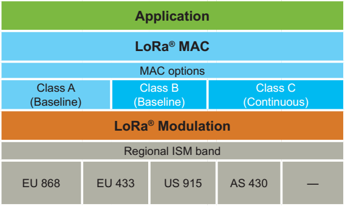
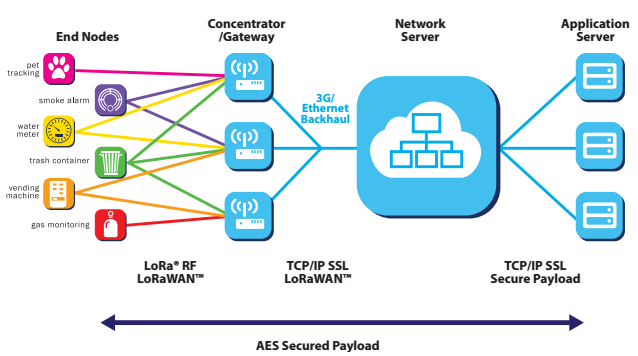
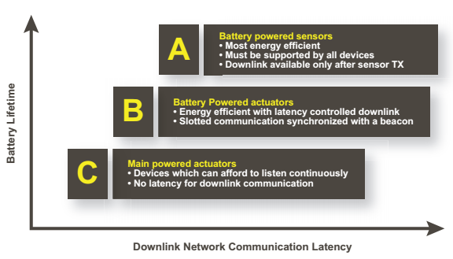
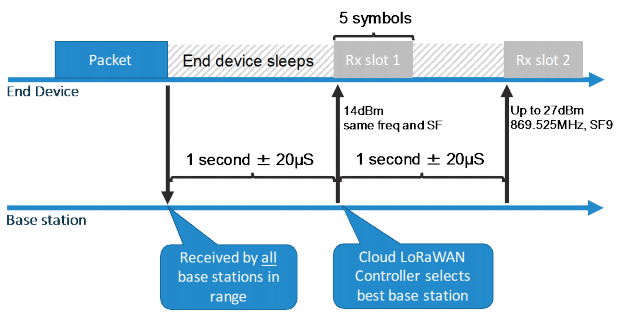
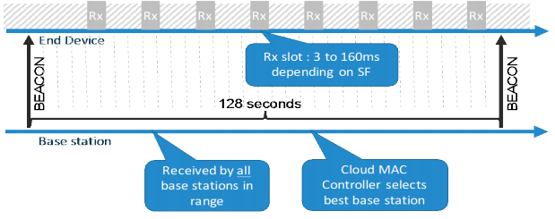
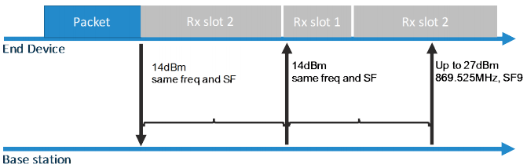

# LoRaWAN là gì?

Như được giới thiệu từ trước, LoRa là một dạng sóng không dây hay còn được coi là lớp vật lý để tạo ra các kết nối truyền thông khoảng cách xa.

LoRaWAN định nghĩa giao thức truyền thông và kiến trúc hệ thống cho mạng trong khi đó lớp vật lý LoRa cho phép các kết nối truyền thông khoảng cách rộng. Nghĩa là trong một mạng LoRaWAN, sóng không dây giao tiếp là sóng LoRa, còn giao thức thì do mạng LoRaWAN định nghĩa.

Chip LoRa được độc quyền bởi Semtech, nhưng mạng LoRaWAN là một mã nguồn mở, được quản lý và bảo trì bởi LoRa Alliance.

Những ưu điểm của mạng LoRaWAN:

Các lớp mạng LoRaWAN:

## Kiến trúc mạng LoRaWAN

Trong một mạng sử dụng kiến trúc mạng lưới, như đã biết, các node cuối đưa thông tin đến các node khác để tăng khoảng cách truyền thông của mạng. Nhưng việc này làm tăng tính phức tạp, đòi hỏi chip phải có sức mạnh nhất định, giảm dung tích của mạng, và giảm thời gian sử dụng pin do các node đều phải chuyển tiếp thông tin không phải của nó.

Để đáp ứng được mục đích đầu tiên là tăng thời gian sử dụng bằng pin, mạng LoRaWAN sử dụng kiến trúc mạng sao trong đó các Gateway trung chuyển thông tin giữa các node cuối và một server chính. 

Hình trên là kiến trúc mạng LoRaWAN, như đã thấy, trong mạng LoRaWAN các node cuối không liên kết với một gateway cố định nào cả. Thay vào đó, dữ liệu mà node cuối phát đi được nhận bởi nhiều gateway. Mỗi gateway sẽ đưa các gói nhận được lên serve mạng đám mây thông qua mạng di động, Ethernet hay Wi-Fi. 

Những công việc phức tạp được chuyển lên server mạng xử lý, nó sẽ lọc các gói tin lặp lại, thực hiện kiểm tra bảo mật, và thực hiện thích nghi tốc độ dữ liệu... Và như thế, công việc của các node cuối và gateway được giảm bót nên yêu cầu chip thực thi không cần quá cao.

## Thời lượng sử dụng bằng pin

Mạng LoRaWAN là bất đồng bộ và các node truyền thông khi đữ liệu của chúng sẵn sàng để gửi đi hoặc có sự kiện hoặc được lặp lịch. Trong mạng lưới hoặc mạng đồng bộ, như mạng Cellular, các node thường xuyên phải "thức giấc" để đồng bộ với mạng và kiểm tra thông tin. Việc đồng bộ này tiêu tốn năng lượng đáng kể và là một trong những lý do khiến thời lượng sử dụng bằng pin giảm đi. Do đó, mạng LoRaWAN tăng đáng kể thời gian sử dụng bằng pin do dùng kiến trúc này.

## Khả năng mở rộng của mạng

Để tạo ra mạng sao tầm xa bền vững, gateway phải có một khả năng tiếp nhận rất cao. Để đạt được điều đó, mạng LoRaWAN sử dụng thuật toán thích nghi tốc độ dữ liệu và bằng cách sử dụng bộ truyền nhận đa kênh truyền ở gateway để nhận được đồng thời các thông tin ở các kênh khác nhau. Các hệ số tới hạn ảnh hưởng tới năng lực của mạng là số lượng kênh truyền xảy ra đồng thời, tốc độ dữ liệu (time on air), độ dài dữ liệu, và tần suất các node gửi thông tin. Do LoRa là điều chế trải phổ, các tín hiệu có hệ số trải phổ trực giao với các tín hiệu có hệ số trải phổ khác. Khi hệ số trải phổ thay đổi, thì tốc độ dữ liệu cũng thay đổi theo.  Gateway nắm lợi thế của tính chất này bằng các cho phép nhận với nhiều tốc độ dữ liệu khác nhau trên cùng một kênh truyền tại cùng một thời điểm.

Nếu một node có đường truyền tốt và gần gateway, nó không lý do gì mà luôn sử dụng tốc độ dữ liệu thấp nhất, bằng việc dịch chuyển lên tốc độ dữ liệu cao hơn, thời gian truyền ngắn lại thì khoảng trống dành cho các node khác được tăng lên.

Đặc trưng này cho phép mạng LoRaWAN có một năng lực mở rộng rất cao và mạng có thể phân chia được. 

## Các lớp mạng thiết bị

Các node cuối phục vụ các ứng dụng khác nhau với những yêu cầu khác nhau. Để đạt được sự tối ưu thì LoRaWAN dùng các lớp mạng khác nhau cho các thiết bị. Các lớp mạng của thiết bị đánh đổi sự trễ đường truyền downlink đối với thời gian sử dụng bằng pin. Trong ứng dụng điều khiển hoặc truyền động, độ trễ đường truyền downlink là một hệ số rất quan trọng.

Hình trên là 3 lớp mạng của LoRaWAN và sự tương quan giữa thời gian sử dụng bằng pin với độ trễ đường truyền downlink.

### Lớp A (class A - có ở phiên bản LoRaWAN 1.0)

Hình trên mô tả giao thức của class A.

**Class A:** các thiết bị ở class A hỗ trợ truyền thông hai chiêu giữa một node và một gateway. Các gói tin tải lên (từ thiết bị tới server) có thể được gửi tại bất kỳ thời gian nào (ngẫu nhiên). Như mô tả ở hình trên, sau khi gửi gói tin thiết bị mở hai cửa sổ để nhận tại một thời gian cố định (Rx slot 1 và Rx slot 2). Nếu server không phản hồi lại ở cửa sổ thời gian nhận nào cả, thì phải đợi tới lần gửi gói tin tiếp theo từ thiết bị. 

Sự hoạt động của class là lựa chọn tiêu thụ điện năng thấp nhất cho các ứng dụng mà chỉ yêu cầu giao tiếp rất ngắn từ server sau khi thiết bị cuối đã gửi gói tin xong.

### Lớp B (class B - có ở phiên bản LoRaWAN 1.1)

Hình trên mô tả giao thức của class B.

**Class B:** là sự mở rộng của class A bằng việc thêm các cửa sổ nhận được lập lịch sẵn cho việc nhận thông tin từ server. Việc sử dụng đồng bộ thời gian báo trước bởi gateway, các thiết bị mở các cửa sổ nhận theo chu kỳ.

### Lớp C (class C - có ở phiên bản LoRaWAN 1.0)

Hình trên mô tả giao thức của class C.

Các thiết bị ở lớp này tiêu thụ điện năng nhiều nhất trong 3 lớp mạng LoRaWAN. 

**Class C:** các thiết bị ở lớp này mở luôn cửa sổ nhận trừ khi chúng truyền thông tin đi. Việc này cho phép độ trễ truyền thông là rất thấp nhưng tiêu tốn rất nhiều năng lượng so với các thiết bị class A và B.

## Bảo mật

Vấn đề bảo luôn là việc rất quan trọng đối với bất kỳ hệ thống truyền thông, đặc biệt là với hệ thống truyền thông không dây.

LoRaWAN sử dụng 2 lớp bảo mật: một cho mạng và một cho ứng dụng.

Hình trên mô tả sự hoạt động 2 lớp bảo mật của mạng LoRaWAN.

`AppSKey` chính là bảo mật cho ứng dụng, nó chỉ được biết bởi thiết bị cuối và ứng dụng (Application). Khi một thiết bị tham gia vào mạng LoRaWAN, một khóa ứng dụng `AppSKey` và một khóa mạng `NwkSKey` được tạo ra. `NwkSkey` được chia sẻ trong mạng, trong khi `AppSKey` vẫn giữ sự bảo mật. Rõ ràng hơn, `NwkSKey` đảm bảo tính tin cậy cho các thiết bị cuối (giống như checksum) trong khi `AppSKey` đảm bảo rằng các thiết bị trong mạng (gateway) không truy cập vào được dữ liệu của thiết bị cuối.

Thuật toán mã hóa `AppSKey` là AES-128.

## Băng tần sử dụng

LoRaWAN hoạt động ở phổ tần số không cần đăng ký, nghĩa là bất kỳ ai cũng có thể sử dụng các tần số radio mà không cần trả tiền. 

Ở các nước khác, có những công ty liên minh với nhau để lập ra một liên minh LoRaWAN, xin sử dụng băng tần miễn phí cố định để quy định rằng thiết bị LoRa chỉ hoạt động ở băng tần này. Điều này giúp cho sự đồng bộ tất cả các thiết bị trong 1 khu vực rộng lớn. 

|Khu vực|Băng tần sử dụng|
|-------|----------------|
|Châu Âu| Băng tần 433 Mhz và 863-870 Mhz |
| Mỹ    | Băng tần 902-928 Mhz            |
| Úc    | Băng tần 902-928 Mhz            |
| Trung Quốc | Băng tần 779-787 Mhz và 470-510 Mhz|

Hiện tại, ở Việt Nam vẫn chưa có quy định quy chuẩn nào cho mạng LoRaWAN. 